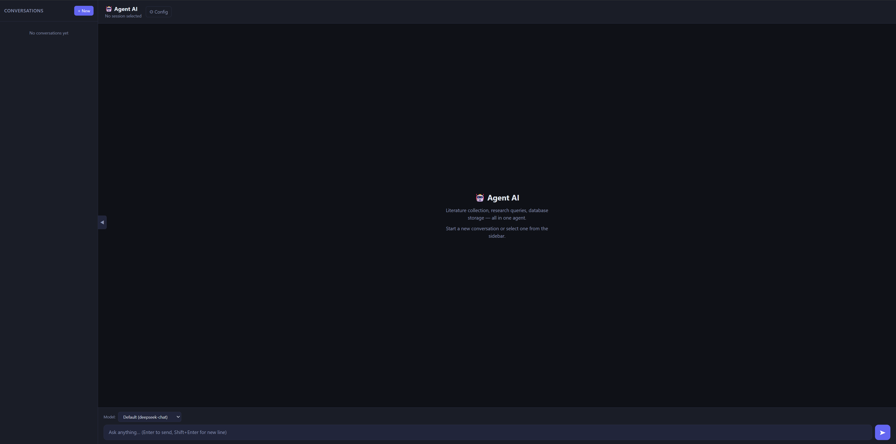

# PaperScientist

An AI-powered literature collection and conversational assistant built with LangGraph + FastAPI.  
It supports multi-turn dialogue, automated paper collection, search tool calling, and MySQL database integration.


---

## Quick Start (One-Click)

Make sure your conda/Python environment is activated, then run:

```bat
setup_and_run.bat
```

This script will:
1. Check that `.env` exists
2. Install all Python dependencies (`pip install -r requirements.txt`)
3. Start the FastAPI server

Open your browser at **http://localhost:8888**

---

## Installation

### Prerequisites

- Python 3.10+ (tested with the `llm` conda environment)
- [Anaconda](https://www.anaconda.com/) or plain Python virtualenv
- MySQL server (optional — only required for database storage features)

### Create environment & install

```bash
# Option A: use an existing conda environment
conda activate llm

# Option B: create a fresh one
conda create -n llm python=3.11 -y
conda activate llm

# Install all dependencies
pip install -r requirements.txt
```

### Key dependencies

| Category | Packages |
|---|---|
| Web framework | `fastapi`, `uvicorn[standard]`, `sse-starlette`, `python-dotenv` |
| LangChain / LangGraph | `langchain`, `langchain-core`, `langgraph`, `langgraph-checkpoint-sqlite` |
| LLM providers | `langchain-openai`, `langchain-anthropic`, `langchain-google-genai`, `langchain-deepseek` |
| Search tools | `tavily-python`, `serpapi` |
| Database | `mysqlclient`, `PyMySQL`, `SQLAlchemy` |
| Async / HTTP | `aiosqlite`, `aiohttp`, `httpx` |

Full pinned versions are in [`requirements.txt`](./requirements.txt).

---

## Configuration

### Option 1 — `.env` file (recommended)

Create a `.env` file in the project root (copy from `.env.example` if provided):

```env
# ── LLM API Keys ────────────────────────────────
GOOGLE_API_KEY=your_google_api_key_here
DEEPSEEK_API_KEY=your_deepseek_api_key_here

# ── Search Tool API Keys ─────────────────────────
TAVILY_API_KEY=your_tavily_api_key_here
SERPAPI_API_KEY=your_serpapi_api_key_here

# ── Observability (optional) ──────────────────────
LANGSMITH_API_KEY=your_langsmith_api_key_here

# ── MySQL Database ────────────────────────────────
MYSQL_HOST=127.0.0.1
MYSQL_PORT=3306
MYSQL_USER=root
MYSQL_PASSWORD=your_password
MYSQL_DATABASE=agentdb

# ── Server ────────────────────────────────────────
TOOL_HOST=0.0.0.0
TOOL_PORT=8088
```

| Variable | Description | Required |
|---|---|---|
| `GOOGLE_API_KEY` | Google Gemini API key ([get one](https://aistudio.google.com/)) | Yes (if using Gemini) |
| `DEEPSEEK_API_KEY` | DeepSeek API key ([get one](https://platform.deepseek.com/)) | Yes (if using DeepSeek) |
| `TAVILY_API_KEY` | Tavily search API key ([get one](https://app.tavily.com/)) | Yes |
| `SERPAPI_API_KEY` | SerpAPI key ([get one](https://serpapi.com/)) | Yes |
| `LANGSMITH_API_KEY` | LangSmith tracing key (optional) | No |
| `MYSQL_*` | MySQL connection info | Only for DB storage features |

### Option 2 — Web UI Config panel

After starting the server, navigate to **http://localhost:8888** and open the **Config** panel in the top-right corner of the UI. You can enter or update API keys and database settings there without editing any files.

---

## Starting the Server

### Manual start

```bash
# From the project root
cd web
python -m uvicorn app:app --host 0.0.0.0 --port 8888 --reload
```

### Stop the server (Windows PowerShell)

```powershell
Get-NetTCPConnection -LocalPort 8888 | Select-Object -ExpandProperty OwningProcess | ForEach-Object { Stop-Process -Id $_ -Force }
```

### Web UI

| URL | Description |
|---|---|
| **http://localhost:8888** | Main chat interface |
| http://localhost:8888/api/models | Available LLM models (JSON) |
| http://localhost:8888/api/env | Current env config (keys masked) |
| http://localhost:8888/api/sessions | Saved conversation sessions |

---

## Project Structure

```
agent/
├── collector.py          # LangGraph agent definition & LLM routing
├── memory.py             # Short/long-term memory management
├── verify.py             # Response validation helpers
├── requirements.txt      # Python dependencies
├── setup_and_run.bat     # One-click install + run (Windows)
├── .env                  # API keys & config (not committed)
├── checkpoints.db        # SQLite checkpoint store (auto-created)
├── tools/                # Tool wrappers (Tavily, SerpAPI, MySQL)
├── memory/               # Persisted memory files
└── web/
    ├── app.py            # FastAPI server & streaming endpoints
    ├── chat_store.py     # Chat session persistence
    └── static/
        └── index.html    # Web UI
```

---

## Supported Models

| Provider | Models |
|---|---|
| Google Gemini | `gemini-2.5-flash`, `gemini-2.5-flash-lite`, `gemini-3.1-flash`, `gemini-3.1-pro-preview` |
| DeepSeek | `deepseek-chat`, `deepseek-reasoner` |

Models can be switched per-request in the web UI or via the `model` field in the API.
